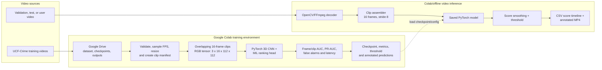

# Spatio-Temporal Video Anomaly Detection

Capstone project for **Madhav Institute of Technology and Science (MITS)**. This project trains a PyTorch 3D CNN **from scratch in Google Colab** to score suspicious behaviour in surveillance video—such as fighting, accidents, theft, robbery, or vandalism. The initial deliverable is a reproducible training, evaluation, and video-inference pipeline; dashboard and edge deployment are future extensions.

## What the system does

1. Receives a UCF-Crime, validation/test, or user-uploaded video file from Google Drive.
2. Builds overlapping, normalized 16-frame RGB clips.
3. Scores each clip with a 3D CNN that learns appearance and motion jointly.
4. Smooths clip scores and applies a configurable persistence threshold to avoid one-frame false alarms.
5. Produces a timestamped anomaly-score timeline and an annotated output video for operator review.

The primary research configuration uses UCF-Crime’s video-level normal/anomalous labels and a multiple-instance learning (MIL) ranking loss. This avoids requiring costly temporal annotations while still producing clip-level scores. Event type is optional: initially the product should label detections as `anomaly`; a type classifier can be added only when suitable class labels and validation data are available.

## System architecture



The component-level design, Colab workflow, data contracts, event-state logic, and evaluation plan are in [SYSTEM_ARCHITECTURE.md](SYSTEM_ARCHITECTURE.md).

## Implementation plan

### Module 1 — data pipeline (team member 1)

- Build a UCF-Crime manifest with video path, split, video-level label, anomaly category if available, FPS, duration, and test temporal ground truth.
- Decode at a fixed target FPS; resize to 128 × 171 then crop/resize to 112 × 112; normalize using the model’s training statistics.
- Generate `[C=3, T=16, H=112, W=112]` clips at stride 8 for training/inference. Keep video identifiers and frame timestamps with every clip.
- Implement the 3D CNN architecture directly in PyTorch with randomly initialized weights—no pretrained backbone or downloaded feature extractor. Feed its learned features to a sigmoid anomaly head.
- Train using positive/negative video bags and MIL ranking loss plus sparsity and temporal-smoothness regularization. Calibrate the threshold on a validation set—never on the test set.
- Evaluate frame-level ROC-AUC, PR-AUC, false-alarm rate per hour, time-to-detect, and per-category performance. Version each model, dataset manifest, and metric report.

### Module 2 — 3D CNN training and evaluation (team member 2)

- Create a Colab notebook that mounts Google Drive, checks the assigned GPU, installs pinned packages, and seeds every random generator for reproducibility.
- Train the from-scratch 3D CNN with checkpoints saved to Drive. Log loss, validation metrics, learning rate, and configuration for every run.
- Test model quality with held-out videos and save raw and smoothed clip scores, timestamps, predictions, and metrics.
- Run offline inference at stride 8 and create an annotated MP4 plus a CSV score timeline for each input video.

### Module 3 — integration and presentation (team member 3)

- Build reusable functions for preprocessing, training, evaluation, and video inference so the same transformations are used everywhere.
- Organize the Colab notebooks and Google Drive output folders; document how a reviewer runs the complete experiment.
- Create visual results: learning curves, ROC/PR curves, a score-over-time plot, and annotated demonstration videos.
- Summarize failure cases (dark scenes, occlusion, crowding, camera shake) and prepare the capstone demonstration workflow.

## Google Colab workflow

1. Place the UCF-Crime dataset or approved subset in Google Drive. Do not commit videos or checkpoints to Git.
2. Open the project notebook in Colab, select a GPU runtime, and mount Drive.
3. Run environment setup, manifest creation, preprocessing, and the training cells in order.
4. Save the best validation checkpoint, configuration JSON, plots, and logs to Drive.
5. Run evaluation once on the held-out test split, then run `predict_video` to generate an annotated video and score CSV.

Recommended Drive layout:

```text
MyDrive/anomaly_detection/
├── data/ucf_crime/       # raw videos and manifests
├── checkpoints/          # best_model.pt and last_model.pt
├── runs/                 # metrics, curves, TensorBoard logs
└── outputs/              # score CSVs and annotated MP4 videos
```

## Suggested repository layout

```text
.
├── data/                 # ignored: raw video, manifests, processed clips
├── notebooks/            # Colab notebooks: setup, training, evaluation, inference
├── training/             # datasets, 3D CNN, losses, train/evaluate functions
├── inference/            # video decoder, clip assembly, overlays, output writer
├── tests/                # unit, integration and parity tests
├── docs/                 # experiments and Colab setup notes
├── README.md
└── SYSTEM_ARCHITECTURE.md
```

## Key operating decisions

- **Anomaly scoring, not guaranteed crime recognition:** score unusual activity first. A reliable class label needs curated labels and separate validation.
- **Temporal stabilization:** create an alert only after `N` consecutive clips exceed the open threshold; close it only after `M` clips fall below a lower close threshold.
- **Evidence:** retain pre- and post-trigger frames, e.g. 10 seconds before and 20 seconds after the trigger, subject to the site’s retention policy.
- **Human in the loop:** the generated score and video overlay are decision support. A reviewer checks detections and records false positives for later retraining.

## References used

- Tran et al., *Learning Spatiotemporal Features with 3D Convolutional Networks*: motivates implementing 3D convolutions from scratch, 16-frame clips, 3×3×3 kernels, and overlapping clip features.
- Sultani, Chen, and Shah, *Real-world Anomaly Detection in Surveillance Videos*: motivates UCF-Crime, weak video-level supervision, MIL ranking, and temporal sparsity/smoothness.
- Pang et al., *Deep Learning for Anomaly Detection: A Review*: highlights rarity, heterogeneous and novel anomalies, class imbalance, false positives, and the need for explainable operator review.

The local reference notes are treated as research sources, not project instructions.
