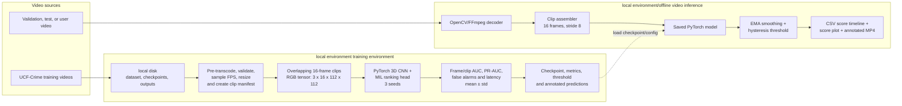

# Spatio-Temporal Video Anomaly Detection

Capstone project for **Madhav Institute of Technology and Science (MITS)**. This project trains a PyTorch 3D CNN **from scratch in local environment** to score suspicious behaviour in surveillance video—such as fighting, accidents, theft, robbery, or vandalism. The initial deliverable is a reproducible training, evaluation, and video-inference pipeline; dashboard and edge deployment are future extensions.

**Research question:** *How far can a compact, from-scratch spatio-temporal model get on weak video-level labels, and what closes the gap to pretrained pipelines?*

## What the system does

1. Receives a UCF-Crime, validation/test, or user-uploaded video file from local disk.
2. Builds overlapping, normalized 16-frame RGB clips.
3. Scores each clip with a 3D CNN that learns appearance and motion jointly.
4. Smooths clip scores and applies a configurable persistence threshold to avoid one-frame false alarms.
5. Produces a timestamped anomaly-score timeline and an annotated output video for operator review.

The primary research configuration uses UCF-Crime's video-level normal/anomalous labels and a multiple-instance learning (MIL) ranking loss. This avoids requiring costly temporal annotations while still producing clip-level scores. Event type is optional: initially the product should label detections as `anomaly`; a type classifier can be added only when suitable class labels and validation data are available.

## System architecture



The component-level design, local environment workflow, data contracts, event-state logic, and evaluation plan are in [SYSTEM_ARCHITECTURE.md](SYSTEM_ARCHITECTURE.md).

## Implementation phases

The project is organized into **six implementation phases** that map directly onto five planned local environment notebooks, plus an environment-setup phase. Each phase lists its concrete tasks and the artefact it must produce before the next phase begins.

### Phase 0 — Environment setup (Notebook `01_setup`)

- Mount local disk and create the persistent folder structure: `data/`, `checkpoints/`, `runs/`, `outputs/`.
- Verify GPU runtime is active; log GPU name, PyTorch/CUDA versions.
- Install pinned dependencies (`opencv-python-headless`, `scikit-learn`, `matplotlib`) and freeze versions to `requirements.txt`.
- Set a global random seed across Python, NumPy, and PyTorch for reproducibility.

**Deliverable:** `environment.json` logged to Drive with package versions, GPU info, and seed.

### Phase 1 — Data pipeline (Notebook `02_prepare_data`)

- Pre-transcode videos once to low-res, 10 fps H.264 and copy to local environment's local disk to speed up reading.
- Scan the UCF-Crime video root and build a manifest: video path, label (normal/anomalous), category, file hash.
- Run a quality pass — reject corrupted files and videos that decode to fewer than 16 frames; log rejections with reasons.
- Use the **official UCF-Crime split**. The official test set (290 videos) is strictly preserved for testing. Carve a validation split out of the official train set.
- Implement the shared preprocessing module: decode at a fixed target FPS (10 fps), resize to 128×171, normalize.
  - For training: random crop to 112×112, horizontal flip, brightness/contrast jitter, and temporal jitter.
  - For inference: feed the full frame (e.g. 112×144) so anomalies near edges aren't discarded.
- Visually spot-check decoded clips and confirm tensor shapes and timestamps before moving on.

**Deliverable:** `manifest_train.csv`, `manifest_val.csv`, `manifest_test.csv`, and a data-quality report.

### Phase 2 — Model and loss implementation

- Implement the custom 3D CNN backbone: stacked 3×3×3 convolution blocks with batch norm, ReLU, and spatial max-pooling, followed by global pooling and a small MLP head producing a single sigmoid anomaly score per clip. Weights are randomly initialized — no pretrained backbone.
- Implement bag scoring: reshape a batch of (bag × clips) into a single forward pass, then reshape scores back for the MIL loss.
- Implement the MIL ranking loss: `max(0, margin − max_score(anomalous_bag) + max_score(normal_bag))`. Use a smaller margin (e.g. 0.5) or compute the loss on logits to prevent the hinge loss from being zero except at perfect saturation.
- Add the sparsity term and the temporal smoothness term, combined with tunable λ weights.
- Unit-test the loss and model shapes on a small synthetic batch before touching real data.

**Deliverable:** reviewed model + loss implementation with a passing shape/gradient smoke test.

### Phase 3 — Training (Notebook `03_train`)

- Build the MIL bag dataset: split each training video into 32 segments and sample one clip per segment (re-jittered every epoch).
- Configure AdamW optimizer, cosine learning-rate schedule, gradient clipping, and mixed-precision (AMP) training for local environment GPU efficiency.
- Add resume-safe checkpointing: save full state (including optimizer, scheduler, GradScaler, and RNG states) in `last_model.pt` every epoch.
- Select and save `best_model.pt` based on **validation AUC improvement**, not validation loss (since MIL loss is a weak proxy for detection quality).
- Log per-epoch train/validation metric components to a CSV for later plotting. **Run training with 3 different seeds to report mean ± std.**

**Deliverable:** `best_model.pt`, `last_model.pt`, training log CSV, `run_config.json`.

### Phase 4 — Evaluation and threshold calibration (Notebook `04_evaluate`)

- Load the frozen best checkpoint only — never the last mid-training checkpoint — for all reported metrics.
- Compute frame-level ROC-AUC and PR-AUC on the concatenated official test set. Run 3 seeds and report mean ± std.
- Compute false alarms per video-hour on held-out normal videos.
- Calibrate the detection threshold on the **validation split only**, targeting a chosen false-positive rate; freeze that threshold to a JSON file.
- Run the frozen threshold once on the test split to produce final metrics — never re-tune after seeing test results.
- Break results down by UCF-Crime category and by failure condition. Compute **automatic failure-condition proxies**: mean brightness (low light), Laplacian variance (blur), global-motion magnitude (camera shake), and person count (crowding).

**Deliverable:** `metrics.json`, ROC/PR curves, `calibrated_threshold.json`, category-wise error breakdown.

### Phase 5 — Offline inference and visualization (Notebook `05_predict_video`)

- Reuse the exact Phase 1 inference preprocessing module to score a new video, clip by clip, using the frozen checkpoint.
- Apply exponential moving average (EMA) smoothing to the raw clip scores.
- Apply hysteresis thresholding: open an anomaly interval after N consecutive clips exceed the calibrated threshold, close it after M consecutive clips fall back below it.
- Write three artefacts per scored video: a timestamp-aligned score CSV, a readable score-timeline plot with flagged intervals shaded, and an annotated MP4 with an on-frame score overlay and a colored border during flagged intervals.

**Deliverable:** per-video `{name}_scores.csv`, `{name}_score_plot.png`, `{name}_annotated.mp4` in the Drive outputs folder.

## Technical configuration summary

### Clip and preprocessing settings

| Parameter | Value | Notes |
|---|---|---|
| Clip length | 16 frames | Matches C3D-style temporal receptive field |
| Stride | 8 frames | 50% overlap between consecutive clips |
| Resize | 128 × 171 | Base resolution |
| Crop (Training) | 112 × 112 | Random crop, plus horizontal flip/jitter |
| Crop (Inference) | None | Feed full frame (e.g. 112×144) to keep edges |
| Target decode FPS | 10 fps | Fixed rate for reproducibility |
| Normalization | Kinetics-style mean/std | Per-channel |

### MIL / loss settings

| Parameter | Value | Notes |
|---|---|---|
| Clips per bag | 32 | One clip sampled per 32 segments, re-jittered every epoch |
| Ranking margin (m) | 0.5 | Anomalous max-score vs normal max-score gap (or use logits) |
| λ sparsity | 8e-5 | Penalizes long anomalous regions |
| λ smoothness | 8e-5 | Penalizes abrupt score jumps between sampled segments |

### Training settings

| Parameter | Value | Notes |
|---|---|---|
| Optimizer | AdamW | lr = 1e-4, weight decay = 5e-5 |
| Schedule | Cosine annealing | Over full epoch budget |
| Epochs (budget) | up to 60 | Early stopping based on val AUC |
| Precision | Mixed precision (AMP) | local environment GPU throughput |
| Batch | 4 bag-pairs / step | = 4 × 2 × 32 clips per forward pass |
| Seeds | 3 | Run with 3 seeds to report mean ± std |

### Inference settings

| Parameter | Value | Notes |
|---|---|---|
| EMA alpha | 0.3 | Smoothing of raw clip scores |
| Enter threshold | calibrated on validation | Opens an anomaly interval |
| Exit threshold | enter − 0.1 | Hysteresis, avoids flicker |
| Enter / exit run length | 3 clips | Consecutive clips required to flip state |

## Team responsibilities

| Module | Owner focus | Primary phases |
|---|---|---|
| Data pipeline | Manifests, decode/normalize, data augmentation, fast loading | Phase 1 |
| 3D CNN training | From-scratch model, MIL loss, validation loop, checkpoints, seeds | Phase 2, 3, 4 |
| Integration and presentation | Shared local environment modules, plots, annotated video, failure proxies | Phase 5, demo |

## Proposed enhancements

### Ablation ladder (must include)

Support the research question by reporting AUC ± std over 3 seeds as features are progressively added:

1. Frame-differencing baseline (classical).
2. Base model (max-MIL).
3. Top-k MIL instead of max-only (more robust to a single noisy clip).
4. (2+1)D or depthwise-separable convolutions (better from-scratch training).
5. An added frame-difference motion channel (strong cue for from-scratch).
6. Self-supervised pretraining on training videos (e.g. playback-speed or clip-order prediction).
7. *(Optional)* A small temporal head (temporal conv or self-attention) over the bag's clip embeddings.
8. *(Optional)* A pretrained frozen-feature reference as an explicit upper bound (clearly labeled).

### Explainability & failure analysis

- **Shortcut analysis:** Train a trivial classifier on cues like camera quality, mean brightness, or scene identity to see if the model learned dataset biases (since normal and anomalous videos come from different sources). Check if the main model's scores correlate with these cues.
- 3D Grad-CAM overlay on flagged clips in the annotated MP4.

### Evaluation rigor

- Cross-dataset generalization check: run the frozen model unmodified on ShanghaiTech Campus (report honestly as domain shift will hurt AUC).
- AUC vs. FLOPs plot: plot model variants with parameters, FLOPs and CPU clips/second (via ONNX export).

## Differentiation strategy

### Campus-safety use case (recommended headline story)

Scope the system to one concrete deployment scenario—campus safety—and tune categories, thresholds, and evaluation around it.

### Category head plus triage scoring

Add a 13-way head trained from video-level category labels to output an explicit category. Convert the anomaly score into a severity tier based on a documented rule (e.g., category priority × score × duration). The triage output can then report: *"possible fighting, 02:14–02:31, severity high, confidence medium."*

### Uncertainty from a seed ensemble

Leverage the 3 training seeds as a deep ensemble to provide uncertainty estimates. Validate this with a risk-coverage curve: show that precision rises when the most uncertain flags are dropped.

### Self-training / weak-to-strong label refinement (optional)

After the base model works, use the ensemble's high-confidence agreement to produce pseudo segment-level labels for a second fine-tuning pass.

## Risk mitigation plan

| Risk | Impact | Mitigation |
|---|---|---|
| Class imbalance / shortcuts | Model learns camera quality instead of events | Shortcut analysis; check correlation with dataset bias |
| Low light, occlusion, shake | Scores reflect quality, not activity | Automatic failure-condition proxies (brightness, blur, global-motion) |
| local environment session resets | Loss of training progress | Save full state (optimizer, RNG, scaler) to Drive every epoch |
| Overfitting from scratch | Poor test generalization | Data augmentation (crop, flip, color jitter, temporal jitter) |
| Slow I/O from Drive | Training bottleneck | Pre-transcode to low-res H.264 and copy to local environment local disk |

## local environment workflow

1. Place the UCF-Crime dataset or approved subset in local disk. Do not commit videos or checkpoints to Git.
2. Open the project notebook in local environment, select a GPU runtime, and mount Drive.
3. Run environment setup, manifest creation, preprocessing, and the training cells in order.
4. Save the best validation checkpoint, configuration JSON, plots, and logs to Drive.
5. Run evaluation once on the held-out test split, then run `predict_video` to generate an annotated video and score CSV.

Recommended Drive layout:

```text
./
├── data/ucf_crime/       # raw videos and manifests
├── checkpoints/          # best_model.pt and last_model.pt
├── runs/                 # metrics, curves, TensorBoard logs
└── outputs/              # score CSVs and annotated MP4 videos
```

## Repository layout

```text
.
├── data/                 # ignored: raw video, manifests, processed clips
├── notebooks/            # local environment notebooks: setup, training, evaluation, inference
├── training/             # datasets, 3D CNN, losses, train/evaluate functions
├── inference/            # video decoder, clip assembly, overlays, output writer
├── tests/                # unit, integration and parity tests
├── docs/                 # experiments and local environment setup notes
├── README.md
└── SYSTEM_ARCHITECTURE.md
```

## Key operating decisions

- **Anomaly scoring, not guaranteed crime recognition:** score unusual activity first. A reliable class label needs curated labels and separate validation.
- **Temporal stabilization:** create an alert only after `N` consecutive clips exceed the open threshold; close it only after `M` clips fall below a lower close threshold.
- **Evidence:** retain pre- and post-trigger frames, e.g. 10 seconds before and 20 seconds after the trigger, subject to the site's retention policy.
- **Human in the loop:** the generated score and video overlay are decision support. A reviewer checks detections and records false positives for later retraining.
- **Official UCF-Crime split:** the official test set (290 videos) is strictly preserved. Validation is carved from the official train set. Threshold is calibrated on validation only, then frozen before any test evaluation.
- **Multi-seed reporting:** run with 3 different seeds and report mean ± std for all key metrics.

## References used

- Tran et al., *Learning Spatiotemporal Features with 3D Convolutional Networks*: motivates implementing 3D convolutions from scratch, 16-frame clips, 3×3×3 kernels, and overlapping clip features.
- Sultani, Chen, and Shah, *Real-world Anomaly Detection in Surveillance Videos*: motivates UCF-Crime, weak video-level supervision, MIL ranking, and temporal sparsity/smoothness.
- Pang et al., *Deep Learning for Anomaly Detection: A Review*: highlights rarity, heterogeneous and novel anomalies, class imbalance, false positives, and the need for explainable operator review.

The local reference notes are treated as research sources, not project instructions.
