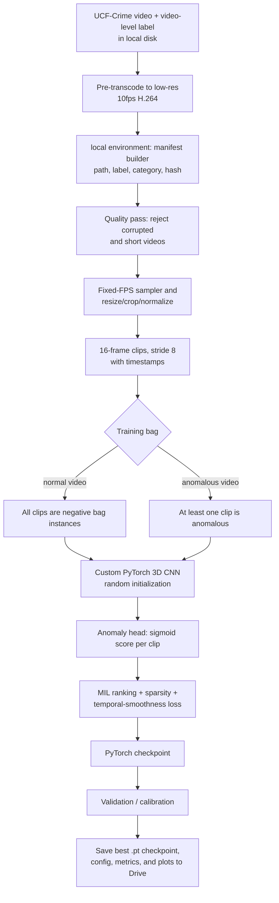
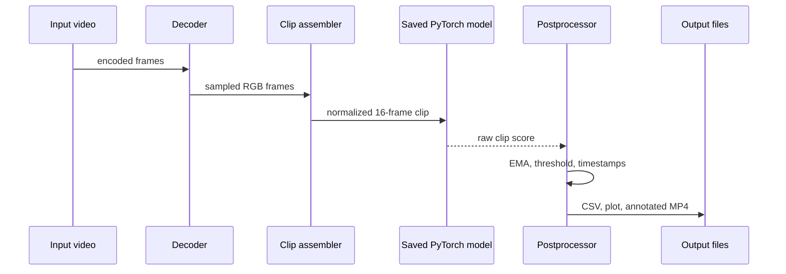
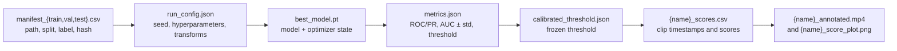

# System Architecture

## 1. Scope and quality goals

The system is implemented and trained in **local environment**. It converts an input video into a timestamped anomaly-score timeline and annotated output video. The model is a PyTorch 3D CNN trained **from randomly initialized weights**; no pretrained backbone, C3D checkpoint, or externally extracted feature vectors are used. It detects **anomalous activity**, not a conclusive crime classification or replacement for human review.

**Core research question:** *How far can a compact, from-scratch spatio-temporal model get on weak video-level labels, and what closes the gap to pretrained pipelines?*

| Goal | Design response |
| --- | --- |
| Understand motion as well as appearance | 3D CNN operates on 16-frame volumes rather than independent 2D frames. |
| Learn from untrimmed UCF-Crime videos | Video bags, weak video-level labels, MIL ranking loss. |
| Fit the capstone environment | local environment GPU runtime with data, checkpoints, and outputs stored in local disk. |
| Reproduce results | Pinned requirements, seeded runs (3 seeds, mean ± std), saved configuration, manifest, checkpoint, and metrics. |
| Reduce noisy clip predictions | EMA smoothing and a validation-calibrated persistence threshold. |
| Preserve review evidence | Timestamped score CSV, score plot, and annotated MP4 per evaluated video. |
| Quantify failure modes | Automatic proxies for low light, blur, camera shake, and crowding. |
| Validate research question | Ablation ladder reporting AUC ± std as features are progressively added. |

## 2. Offline training architecture



### Data contract

Each manifest row and each emitted prediction is traceable to a source video and time interval.

```json
{
  "camera_id": "gate-01",
  "stream_id": "gate-01-2026-08-24T10:15:00Z",
  "clip_start_ms": 42000,
  "clip_end_ms": 42533,
  "input_shape": [3, 16, 112, 112],
  "anomaly_score": 0.84,
  "smoothed_score": 0.79,
  "model_version": "scratch-3dcnn-mil-2026.08.1",
  "checkpoint_path": "./checkpoints/best_model.pt"
}
```

### Training objective

For an anomalous bag `A` and normal bag `N`, the model should score the most suspicious clip in `A` above the most suspicious clip in `N` by margin `m`:

`L_rank = max(0, m - max(s(A)) + max(s(N)))`

Use the total loss below, tuning `λ_sparse` and `λ_smooth` on validation data:

`L = L_rank + λ_sparse Σ s(A) + λ_smooth Σ |s_t - s_(t-1)|`

The sparse term reflects that an anomaly commonly occupies a short interval; the smoothness term discourages erratic adjacent scores. Preserve clip timestamps during training and testing to make frame-level evaluation possible.

The ranking loss is computed on **raw logits** (not sigmoid probabilities) to prevent gradient saturation. Sparsity and smoothness terms use sigmoid scores. Both max-MIL and top-k MIL aggregation modes are supported.

### Data pipeline details

- **Pre-transcoding:** videos are transcoded once to low-res, 10 fps H.264 and copied to local environment's local disk to avoid Drive I/O bottlenecks during training.
- **Manifest schema:** video path, label (0=normal, 1=anomalous), category, file hash, split.
- **Quality gate:** reject corrupted files and videos decoding to fewer than 16 frames; log rejections with reasons.
- **Official UCF-Crime split:** the official test set (290 videos) is strictly preserved for testing to ensure frame-level AUC is defined and comparable. Validation is carved from the official train set.

## 3. Technical configuration

### 3.1 Clip and preprocessing settings

| Parameter | Value | Notes |
|---|---|---|
| Clip length | 16 frames | Matches C3D-style temporal receptive field |
| Stride | 8 frames | 50% overlap between consecutive clips |
| Resize | 128 × 171 | Base resolution |
| Crop (Training) | 112 × 112 | Random crop, plus horizontal flip/jitter |
| Crop (Inference) | None | Feed full frame (e.g. 112×144) to keep edges |
| Target decode FPS | 10 fps | Fixed rate for reproducibility |
| Normalization | Kinetics-style mean/std | Per-channel |

### 3.2 MIL / loss settings

| Parameter | Value | Notes |
|---|---|---|
| Clips per bag | 32 | One clip sampled per 32 segments, re-jittered every epoch |
| Ranking margin (m) | 0.5 | Anomalous max-score vs normal max-score gap (or use logits) |
| λ sparsity | 8e-5 | Penalizes long anomalous regions |
| λ smoothness | 8e-5 | Penalizes abrupt score jumps between sampled segments |

### 3.3 Training settings

| Parameter | Value | Notes |
|---|---|---|
| Optimizer | AdamW | lr = 1e-4, weight decay = 5e-5 |
| Schedule | Cosine annealing | Over full epoch budget |
| Epochs (budget) | up to 60 | Early stopping based on val AUC |
| Precision | Mixed precision (AMP) | local environment GPU throughput |
| Batch | 4 bag-pairs / step | = 4 × 2 × 32 clips per forward pass |
| Seeds | 3 | Run with 3 seeds to report mean ± std |

### 3.4 Inference settings

| Parameter | Value | Notes |
|---|---|---|
| EMA alpha | 0.3 | Smoothing of raw clip scores |
| Enter threshold | calibrated on validation | Opens an anomaly interval |
| Exit threshold | enter − 0.1 | Hysteresis, avoids flicker |
| Enter / exit run length | 3 clips | Consecutive clips required to flip state |

## 4. Offline video inference and decision logic



Recommended annotation state machine:

```text
NORMAL -- score ≥ threshold for N clips --> ANOMALY_INTERVAL
ANOMALY_INTERVAL -- score stays high --> EXTEND_INTERVAL
ANOMALY_INTERVAL -- score < threshold for M clips --> NORMAL
```

Starting configuration: EMA `α=0.3`, threshold calibrated on validation, `N=3`, and `M=3`. The threshold is calibrated on the validation split targeting a chosen false-positive rate and frozen to `calibrated_threshold.json` before any test evaluation.

### Output artefacts per video

- `{name}_scores.csv` — timestamp-aligned clip scores (raw, smoothed, anomaly flag)
- `{name}_score_plot.png` — readable score-timeline plot with flagged intervals shaded
- `{name}_annotated.mp4` — annotated video with on-frame score overlay and colored border during flagged intervals

## 5. local environment notebook boundaries

| Component | Responsibilities | Interfaces |
| --- | --- | --- |
| `01_setup.ipynb` | Mount Drive, install versions, choose GPU, set seeds and paths | local environment runtime → `environment.json` |
| `02_prepare_data.ipynb` | Pre-transcode, build manifests, validate files, decode/preprocess clips | UCF-Crime videos → `manifest_{train,val,test}.csv` |
| `03_train.ipynb` | Define custom 3D CNN, MIL loss, optimizer, training loop, checkpoints (3 seeds) | training bags → `.pt` checkpoint/logs |
| `04_evaluate.ipynb` | Load best checkpoint and calculate final metrics/curves, calibrate threshold | test videos → `metrics.json`, `calibrated_threshold.json` |
| `05_predict_video.ipynb` | Score an arbitrary video, smooth scores, create overlays | video → CSV/plot/annotated MP4 |

All notebooks import shared project modules for dataset loading, preprocessing, model definition, loss, metrics, and video annotation. This avoids the common error of training and inference using different frame transforms.

## 6. Experiment artefact design



Store the manifest, configuration, checkpoint hash, and selected threshold alongside every metric report. That provenance allows a result to be reproduced from the same data split and code revision.

## 7. Notebook run contract

| Step | Required input | Output |
| --- | --- | --- |
| Setup | local environment GPU runtime and Drive access | `environment.json`, installed dependencies and project paths |
| Prepare | source dataset folder and labels | deterministic `manifest_{train,val,test}.csv`, data-quality report |
| Train | manifest + configuration | periodic and best validation checkpoints (per seed) |
| Evaluate | frozen best checkpoint + test manifest | `metrics.json`, ROC/PR curves, `calibrated_threshold.json`, category/failure breakdown |
| Predict | checkpoint + any supported video | `{name}_scores.csv`, `{name}_score_plot.png`, `{name}_annotated.mp4` |

## 8. Proposed enhancements

### 8.1 Ablation ladder

Report AUC ± std over 3 seeds as features are progressively added:

1. Frame-differencing baseline (classical).
2. Base model (max-MIL).
3. Top-k MIL instead of max-only (more robust to a single noisy clip).
4. (2+1)D or depthwise-separable convolutions (better from-scratch training).
5. An added frame-difference motion channel (strong cue for from-scratch).
6. Self-supervised pretraining on training videos (e.g. playback-speed or clip-order prediction).
7. *(Optional)* A small temporal head (temporal conv or self-attention) over the bag's clip embeddings.
8. *(Optional)* A pretrained frozen-feature reference as an explicit upper bound (clearly labeled).

### 8.2 Explainability & failure analysis

- **Shortcut analysis:** train a trivial classifier on cues like camera quality, mean brightness, or scene identity to detect whether the model learned dataset biases.
- **3D Grad-CAM** overlay on flagged clips in the annotated MP4.
- **Automatic failure-condition proxies:** mean brightness (low light), Laplacian variance (blur), global-motion magnitude (camera shake), person count (crowding).

### 8.3 Evaluation rigor

- Cross-dataset generalization check: run the frozen model unmodified on ShanghaiTech Campus.
- AUC vs. FLOPs plot: plot model variants with parameters, FLOPs and CPU clips/second (via ONNX export).

### 8.4 Differentiation strategy

- **Campus-safety use case:** scope the system to campus safety as a headline deployment story.
- **Category head + triage scoring:** add a 13-way head for explicit category output with severity tiers.
- **Seed ensemble uncertainty:** leverage 3 seeds as a deep ensemble for uncertainty estimates and risk-coverage curves.
- **Self-training (optional):** use ensemble high-confidence agreement to produce pseudo segment-level labels for fine-tuning.

## 9. local environment execution topology

For the capstone, execute the project in a local environment GPU session:

```text
local environment runtime
├── Python + PyTorch + OpenCV/FFmpeg
├── GPU selected by local environment availability
├── notebooks or shared source modules
├── pre-transcoded video cache (local disk)
└── temporary runtime files

local disk
├── UCF-Crime dataset and manifests
├── checkpoints and configurations
├── training logs and plots
└── annotated inference outputs
```

local environment runtimes are ephemeral. Persist all essential artefacts to Drive, expect a session disconnect, and make each notebook resumable from its saved checkpoint. A production web/edge deployment may later export the validated model to ONNX/TensorRT, but that is outside this from-scratch local environment implementation.

## 10. Verification gates

1. **Dataset gate:** no corrupted video; quality pass with rejection logging; label/split leakage check; official UCF-Crime test set (290 videos) preserved; deterministic manifest and clip timestamp checks.
2. **Model gate:** validation ROC-AUC and PR-AUC reported with mean ± std over 3 seeds; threshold frozen before final test evaluation.
3. **Reproducibility gate:** rerun evaluation from the saved best checkpoint and confirm matching metrics within an agreed tolerance.
4. **Inference gate:** verify preprocessing shape/dtype/order and check that the saved checkpoint produces timestamp-aligned score CSV and playable annotated MP4.
5. **Detection gate:** report false alarms per video or hour and time-to-detect alongside AUC; evaluate darkness, occlusion, crowding, and unseen normal activities using automatic failure-condition proxies.
6. **local environment gate:** all important data, models, metrics, and plots persist in Drive; the notebook can resume after a runtime reset.

## 11. Risks and mitigations

| Risk | Impact | Mitigation |
| --- | --- | --- |
| Class imbalance / shortcuts | Model learns camera quality instead of events | Shortcut analysis; check correlation with dataset bias. |
| Low light, occlusion, shake | Scores reflect quality, not activity | Automatic failure-condition proxies (brightness, blur, global-motion). |
| False positives from shadows, crowds, or camera shake | Noisy alerts | Per-camera validation, smoothing/hysteresis, background quality checks, human acknowledgement. |
| local environment runtime disconnects | Loss of training progress | Save full state (optimizer, RNG, scaler) to Drive every epoch. |
| Limited local environment GPU/session time | Slow progress | Use a small approved subset during debugging, mixed precision, resume-capable training. |
| Slow I/O from Drive | Training bottleneck | Pre-transcode to low-res H.264 and copy to local environment local disk. |
| Overfitting from scratch | Poor test generalization | Data augmentation (crop, flip, color jitter, temporal jitter). |
| Inconsistent notebook transforms | Train/test skew | Import shared preprocessing code and record every transform in `run_config.json`. |

## 12. Research traceability

The architecture specifically draws from the supplied notes: C3D's 3D spatio-temporal convolutions, 3×3×3 kernels, and 16-frame overlapping clips; UCF-Crime's long untrimmed surveillance data and weak MIL ranking strategy with smoothness/sparsity; and the anomaly-detection review's cautions around rarity, heterogeneity, false positives, novel anomalies, and explanation. These materials inform the from-scratch local environment design—they do not impose implementation instructions.
