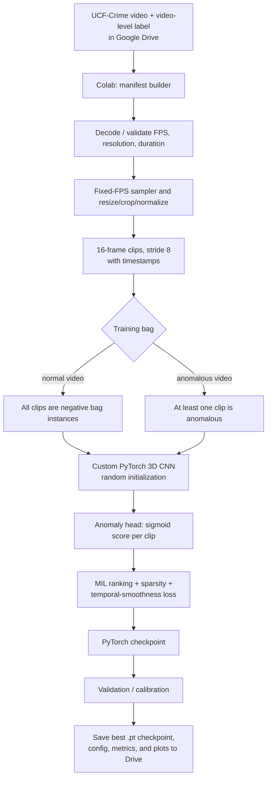
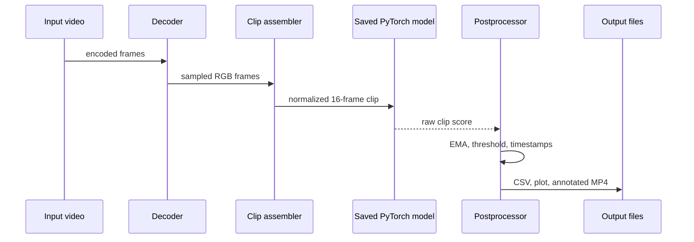
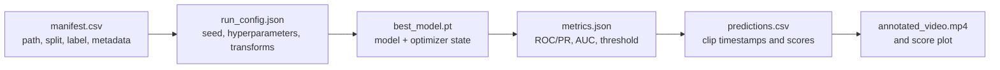

# System Architecture

## 1. Scope and quality goals

The system is implemented and trained in **Google Colab**. It converts an input video into a timestamped anomaly-score timeline and annotated output video. The model is a PyTorch 3D CNN trained **from randomly initialized weights**; no pretrained backbone, C3D checkpoint, or externally extracted feature vectors are used. It detects **anomalous activity**, not a conclusive crime classification or replacement for human review.

| Goal | Design response |
| --- | --- |
| Understand motion as well as appearance | 3D CNN operates on 16-frame volumes rather than independent 2D frames. |
| Learn from untrimmed UCF-Crime videos | Video bags, weak video-level labels, MIL ranking loss. |
| Fit the capstone environment | Google Colab GPU runtime with data, checkpoints, and outputs stored in Google Drive. |
| Reproduce results | Pinned requirements, seeded runs, saved configuration, manifest, checkpoint, and metrics. |
| Reduce noisy clip predictions | EMA smoothing and a validation-calibrated persistence threshold. |
| Preserve review evidence | Timestamped score CSV, score plot, and annotated MP4 per evaluated video. |

## 2. Offline training architecture



### Data contract

Each manifest row and each emitted prediction is traceable to a source video and time interval.

```json
{
  "camera_id": "gate-01",
  "stream_id": "gate-01-2026-08-24T10:15:00Z",
  "clip_start_ms": 42000,
  "clip_end_ms": 42533,
  "input_shape": [3, 16, 112, 112],
  "anomaly_score": 0.84,
  "smoothed_score": 0.79,
  "model_version": "scratch-3dcnn-mil-2026.08.1",
  "checkpoint_path": "MyDrive/anomaly_detection/checkpoints/best_model.pt"
}
```

### Training objective

For an anomalous bag `A` and normal bag `N`, the model should score the most suspicious clip in `A` above the most suspicious clip in `N` by margin `m`:

`L_rank = max(0, m - max(s(A)) + max(s(N)))`

Use the total loss below, tuning `λ_sparse` and `λ_smooth` on validation data:

`L = L_rank + λ_sparse Σ s(A) + λ_smooth Σ |s_t - s_(t-1)|`

The sparse term reflects that an anomaly commonly occupies a short interval; the smoothness term discourages erratic adjacent scores. Preserve clip timestamps during training and testing to make frame-level evaluation possible.

## 3. Offline video inference and decision logic



Recommended annotation state machine:

```text
NORMAL -- score ≥ threshold for N clips --> ANOMALY_INTERVAL
ANOMALY_INTERVAL -- score stays high --> EXTEND_INTERVAL
ANOMALY_INTERVAL -- score < threshold for M clips --> NORMAL
```

Starting configuration: EMA `α=0.35`, `threshold=0.75`, `N=2`, and `M=3`. These are initial values only; select the threshold using validation data, then freeze it before testing.

## 4. Colab notebook boundaries

| Component | Responsibilities | Interfaces |
| --- | --- | --- |
| `01_setup.ipynb` | Mount Drive, install versions, choose GPU, set seeds and paths | Colab runtime → environment |
| `02_prepare_data.ipynb` | Build manifests, validate files, decode/preprocess clips | UCF-Crime videos → manifest/clip metadata |
| `03_train.ipynb` | Define custom 3D CNN, MIL loss, optimizer, training loop, checkpoints | training bags → `.pt` checkpoint/logs |
| `04_evaluate.ipynb` | Load best checkpoint and calculate final metrics/curves | test videos → metric report |
| `05_predict_video.ipynb` | Score an arbitrary video, smooth scores, create overlays | video → CSV/plot/annotated MP4 |

All notebooks import shared project modules for dataset loading, preprocessing, model definition, loss, metrics, and video annotation. This avoids the common error of training and inference using different frame transforms.

## 5. Experiment artefact design



Store the manifest, configuration, checkpoint hash, and selected threshold alongside every metric report. That provenance allows a result to be reproduced from the same data split and code revision.

## 6. Notebook run contract

| Step | Required input | Output |
| --- | --- | --- |
| Setup | Colab GPU runtime and Drive access | installed dependencies and project paths |
| Prepare | source dataset folder and labels | deterministic train/validation/test manifests |
| Train | manifest + configuration | periodic and best validation checkpoints |
| Evaluate | frozen best checkpoint + test manifest | metrics JSON, ROC/PR curves, error analysis |
| Predict | checkpoint + any supported video | clip-score CSV, plot, and annotated MP4 |

## 7. Google Colab execution topology

For the capstone, execute the project in a Google Colab GPU session:

```text
Google Colab runtime
├── Python + PyTorch + OpenCV/FFmpeg
├── GPU selected by Colab availability
├── notebooks or shared source modules
└── temporary runtime files

Google Drive
├── UCF-Crime dataset and manifests
├── checkpoints and configurations
├── training logs and plots
└── annotated inference outputs
```

Colab runtimes are ephemeral. Persist all essential artefacts to Drive, expect a session disconnect, and make each notebook resumable from its saved checkpoint. A production web/edge deployment may later export the validated model to ONNX/TensorRT, but that is outside this from-scratch Colab implementation.

## 8. Verification gates

1. **Dataset gate:** no corrupted video; label/split leakage check; deterministic manifest and clip timestamp checks.
2. **Model gate:** validation ROC-AUC and PR-AUC reported with confidence intervals where practical; threshold frozen before final test evaluation.
3. **Reproducibility gate:** rerun evaluation from the saved best checkpoint and confirm matching metrics within an agreed tolerance.
4. **Inference gate:** verify preprocessing shape/dtype/order and check that the saved checkpoint produces timestamp-aligned score CSV and playable annotated MP4.
5. **Detection gate:** report false alarms per video or hour and time-to-detect alongside AUC; evaluate darkness, occlusion, crowding, and unseen normal activities.
6. **Colab gate:** all important data, models, metrics, and plots persist in Drive; the notebook can resume after a runtime reset.

## 9. Risks and mitigations

| Risk | Mitigation |
| --- | --- |
| Class imbalance and unseen anomalies | Train with normal and anomalous bags, evaluate by category, retain uncertain events for review/retraining. |
| False positives from shadows, crowds, or camera shake | Per-camera validation, smoothing/hysteresis, background quality checks, human acknowledgement. |
| Poor low-light or occluded video | Monitor video-quality metrics, use diverse training data, flag degraded camera state instead of overconfident alerts. |
| Colab runtime disconnects | Save checkpoints, configuration, and logs to Drive at every epoch; resume from the most recent checkpoint. |
| Limited Colab GPU/session time | Use a small approved subset during debugging, mixed precision when supported, and resume-capable training. |
| Inconsistent notebook transforms | Import shared preprocessing code and record every transform in `run_config.json`. |

## 10. Research traceability

The architecture specifically draws from the supplied notes: C3D’s 3D spatio-temporal convolutions, 3×3×3 kernels, and 16-frame overlapping clips; UCF-Crime’s long untrimmed surveillance data and weak MIL ranking strategy with smoothness/sparsity; and the anomaly-detection review’s cautions around rarity, heterogeneity, false positives, novel anomalies, and explanation. These materials inform the from-scratch Colab design—they do not impose implementation instructions.
