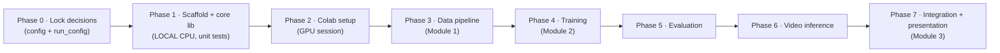

# Implementation Guide — Spatio-Temporal Video Anomaly Detection

A step-by-step implementation plan for the capstone project. This doc is written for a reviewer/mentor: it states **what to build, in what order, where it runs, and what the deliverable of each phase is.**

- **What the system does:** a PyTorch 3D CNN trained **from scratch** in Google Colab scores suspicious activity (fighting, accidents, theft, vandalism, etc.) in surveillance video, producing a timestamped anomaly-score timeline and an annotated output video.
- **Two machines are involved:** the *code* is written locally and tested on CPU here, but the *GPU-dependent work* (video decoding, training) runs in Google Colab + Google Drive.
- **Read in order:** start at the top. Each phase depends on the previous one, so they must be built in sequence (see the flowchart at the end).

---

## How to read this guide

1. **Phase 0** locks the decisions so nothing is re-decided later. Read it first.
2. **Phase 1** is fully doable on a normal CPU machine — no GPU, no dataset, no Colab needed. **This is where the bulk of the code is written and where it is verified.**
3. **Phase 2 onward** require a GPU Colab runtime. They import the shared code from Phase 1.
4. Every phase lists a **deliverable** — the concrete artifact you can point a mentor at to show progress.

The whole project is split across **three teams**: data pipeline (M1), training + evaluation (M2), and integration/presentation (M3). Phases below are numbered for sequencing; see the "Responsibilities" table near the end for the team split.

---

## Phase 0 — Lock the contract (decisions)

*Goal: write down the key operating decisions so the implementation is unambiguous. ~0.5 day, no code needed.*

Decide and record these once — they drive every later module:

| Decision | Value | Why |
|---|---|---|
| Input frame size | `112 x 112` (RGB, 3 channels) | Matches the architecture/data contract; avoid the ambiguous `128x171` mention |
| Clip length | `T = 16` frames | Matches the C3D-style 3D CNN (Tran et al.) |
| Clip stride | `8` frames | Heavy overlap; helps the MIL ranking head |
| Target decode FPS | `25 fps` (fixed) | Removes frame-rate variance between cameras/videos |
| Random seeding | Fixed seed for Python/NumPy/torch (record per-run) | Reproducibility gate |
| Loss margin `m` | chosen, logged | MIL ranking margin |
| Loss weights | `λ_sparse`, `λ_smooth` — tuned on validation | Sparsity + temporal smoothness |
| Alert thresholds (initial) | EMA `α=0.35`, `threshold=0.75`, `N=2`, `M=3` | Placeholder — **threshold must be validated, never frozen until chosen on validation** |
| Evidence window | 10 s pre-trigger, 20 s post-trigger | Retention-policy aware |

**Deliverable:** a `run_config.json` schema + a short "Decisions" note. This becomes the source of truth every module loads.

---

## Phase 1 — Scaffold + core library (local, CPU, unit-tested)

*Goal: build the whole framework in importable Python modules and verify it with CPU-only tests. No GPU, no dataset, no Colab. **This is the de-risking phase** — if it works on a laptop, the Colab steps become mechanical.*

### What to build
1. **Scaffold the repo** (exact layout below).
2. **`training/` package:** config + seeds, dataset/manifest + clip sampling + transforms, the from-scratch 3D CNN, the anomaly head, the MIL/sparse/smoothness losses, metrics, train loop, evaluate function.
3. **`inference/` package:** decoder, clip assembler, postprocessor (EMA + hysteresis), overlays, `predict_video`.
4. **`tests/` package:** unit tests, an integration test (train a tiny model, then run inference and check the transforms match), and a parity test (train-transform == inference-transform).

### Key design rule for this phase
Keep the model, transforms, and losses as **pure PyTorch modules**. Do **not** glue them into Colab notebook cells. This lets everything be tested on CPU locally and imported into Colab later.

### Repo layout to create
```text
.
├── data/                 # ignored: raw video, manifests, processed clips
├── notebooks/            # 01_setup / 02_prepare_data / 03_train / 04_evaluate / 05_predict_video
├── training/             # datasets, 3D CNN, losses, train/evaluate
│   ├── config.py
│   ├── dataset/          # manifest, clip sampling, transforms, split io
│   ├── model/            # scratch_3dcnn.py, anomaly_head.py
│   ├── loss.py
│   ├── metrics.py
│   ├── train.py
│   └── evaluate.py
├── inference/            # video decoder, clip assembly, overlays, output writer
│   ├── decoder.py
│   ├── clip_assembler.py
│   ├── postprocess.py
│   ├── overlays.py
│   └── predict_video.py
├── tests/                # unit / integration / parity tests
├── docs/                 # this guide, Colab setup notes
├── README.md
└── SYSTEM_ARCHITECTURE.md
```

### What to test locally
- Transforms produce `[3, 16, 112, 112]` float32 tensors with a fixed seed → deterministic clips.
- 3D CNN + head runs a forward pass on CPU without error.
- Train/inference use identical transforms (parity test).

### Deliverable: passing CPU tests
A green test run proves the framework is correct before any GPU time is spent. **This is the milestone to show a mentor first.**

---

## Phase 2 — Colab setup notebook (`01_setup.ipynb`)

*Runs only on a GPU Colab runtime. ~0.5 day.*

Steps to encode in the notebook:
1. Select GPU runtime.
2. Install/verify pinned packages (PyTorch, OpenCV, ffmpeg, etc.).
3. Mount Google Drive; confirm the Drive layout from the README:
   ```text
   MyDrive/anomaly_detection/
   ├── data/ucf_crime/
   ├── checkpoints/
   ├── runs/
   └── outputs/
   ```
4. Set seeds and project paths; print the GPU and Torch version.

**Deliverable:** a setup notebook that prints the runtime config and exposes the shared project paths.

---

## Phase 3 — Data pipeline (`02_prepare_data.ipynb`) — Module 1

*Needs the UCF-Crime dataset (videos + a CSV of split/label/category) uploaded to Drive. Owned by the data-pipeline team.*

Steps:
1. Build a **manifest** per video: path, split (train/val/test), video-level label (normal/anomalous), anomaly category if available, FPS, duration.
2. **Validate/decode** each video: check it decodes, validate FPS, sample at the fixed target FPS (25).
3. **Resize → crop → normalize** using the model's training statistics.
4. Generate timestamped `[3, 16, 112, 112]` clips at stride 8 for train/val/test.
5. Produce **deterministic splits** (no label leakage across splits).

**Deliverable:** `manifest.csv` files + deterministic train/val/test clip metadata.

**Gate:** no corrupted video; no split leakage; deterministic clip timestamps.

---

## Phase 4 — Training (`03_train.ipynb`) — Module 2

*Needs the manifests from Phase 3 and a GPU. This is the longest phase.*

Steps:
1. Define the from-scratch 3D CNN + sigmoid anomaly head (imported from `training/`).
2. Define the total loss:
   - **MIL ranking:** for anomalous bag A and normal bag N, push the most suspicious clip in A above the most suspicious in N by margin `m`: `L_rank = max(0, m - max(s(A)) + max(s(N)))`.
   - **Sparsity:** `λ_sparse Σ s(A)` — anomalies are short-lived.
   - **Temporal smoothness:** `λ_smooth Σ |s_t - s_(t-1)|`.
   - `L = L_rank + λ_sparse·Σs(A) + λ_smooth·Σ|Δs|`.
3. Run optimizer + scheduler; log loss, LR, validation metrics every epoch.
4. Save **periodic and best-validation checkpoints** to Drive (resume-capable).
5. Calibrate the threshold on the **validation set only**.

**Deliverable:** `best_model.pt` + `last_model.pt` + a training-log of metrics/curves.

**Risks handled here:** Colab disconnect (save every epoch), limited GPU time (small approved subset for debugging, mixed precision when available).

---

## Phase 5 — Evaluation (`04_evaluate.ipynb`)

*Loads the frozen best checkpoint from Phase 4 and runs on the test split. Threshold must already be validated/frozen.*

Steps:
1. Compute **frame-level ROC-AUC and PR-AUC**, with confidence intervals where practical.
2. Compute **false-alarm rate per hour**, **time-to-detect**, and **per-category** performance.
3. Generate **ROC/PR curves** and error analysis.
4. Save `metrics.json` (with ROC/PR AUC + the selected threshold) alongside the checkpoint.

**Gate:** rerun evaluation from the saved best checkpoint and confirm metrics match within tolerance (reproducibility).

---

## Phase 6 — Video inference (`05_predict_video.ipynb`)

*Runs on GPU or offline on any machine. Fully reusable once `inference/` is built.*

Steps:
1. Decode an arbitrary video (OpenCV/FFmpeg) and sample at 25 fps.
2. Assemble 16-frame clips at stride 8 → score each with the saved model.
3. **Post-process:** EMA smoothing (α=0.35) → run the hysteresis state machine:
   - `NORMAL → ANOMALY_INTERVAL` when score ≥ threshold for `N=2` clips,
   - `ANOMALY_INTERVAL → EXTEND` while high,
   - `ANOMALY_INTERVAL → NORMAL` after `M=3` clips below a lower close threshold.
4. Emit a **CSV score timeline** (timestamps + raw/smoothed scores), a **score-over-time plot**, and an **annotated MP4** (pre/post-trigger evidence window).

**Deliverable:** per-video `predictions.csv`, score plot, and annotated MP4.

**Inference gate:** verify preprocessing shape/dtype/order; confirm the checkpoint produces a timestamp-aligned CSV and a playable MP4.

---

## Phase 7 — Integration + presentation (Module 3)

*Ties everything together and produces the capstone artifacts.*

Deliverables:
- Reusable function registry (preprocessing, training, eval, inference) so every stage uses identical transforms.
- Organized Colab notebooks + Drive folders; a written runbook for a reviewer.
- Visual results: learning curves, ROC/PR curves, score-over-time plots, annotated demo videos.
- Failure-case writeup (dark scenes, occlusion, crowding, camera shake) and the demo workflow.

**Deliverable:** the capstone demo runbook + a results package the mentor can review.

---

## Sequence (dependency order)



## Estimated timeline
- **Week 1 (today):** Phases 0–1 + tests — all local, no GPU/dataset needed. ✅
- **Week 2:** Phases 2–3 (needs dataset in Drive).
- **Week 3:** Phase 4 (training).
- **Week 4:** Phases 5–6.
- **Week 5:** Phase 7 + docs + final demo runbook.

---

## Team responsibilities
- **Module 1 (data pipeline):** Phase 3, plus `tests/` and most of Phase 1 (preprocessing/transforms/dataset).
- **Module 2 (training + evaluation):** Phase 4, Phase 5, plus most of Phase 1 (model, losses, train/eval).
- **Module 3 (integration + presentation):** Phase 2 (Colab setup), Phase 6 (inference glue), Phase 7, and cross-cutting integration/parity tests.

All three teams contribute to Phase 1, since a working, tested local scaffold is the prerequisite for everything downstream.

---

## Why Phase 1 first
The GPU and dataset are the two things that cannot be built on a normal machine. By putting **all framework design, the model, the transforms, and the losses behind a local, unit-tested codebase**, the Colab phases become mechanical: mount Drive → run the notebooks → read the results. If Phase 1 passes, the remaining phases have no correctness risk to hide.

## Colab vs local split (for the mentor)
- **Local (this machine):** Phases 0–1 — code, structure, and CPU tests. OpenCV + FFmpeg are already available here.
- **Colab GPU:** Phases 2–6 — video decoding at target FPS, training, and evaluation. Outputs persist to Drive.
- **Anywhere:** Phase 6 (inference) runs offline once the modules exist.
